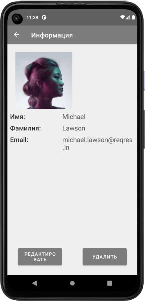
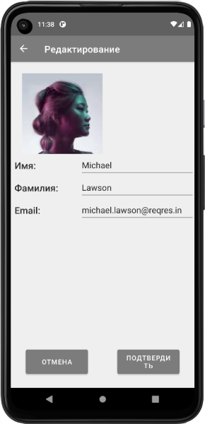
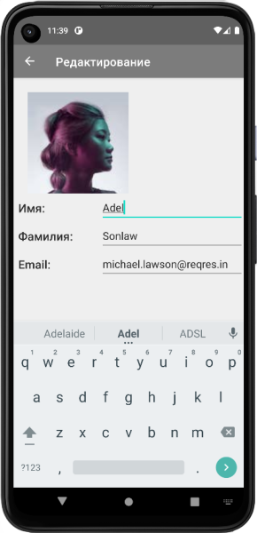
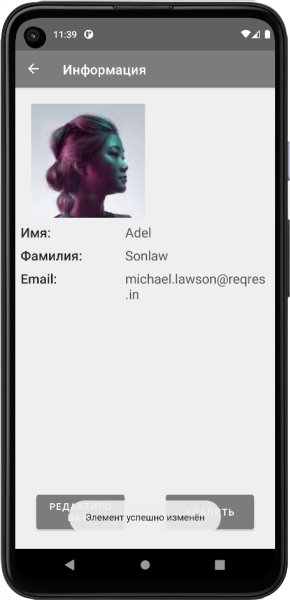
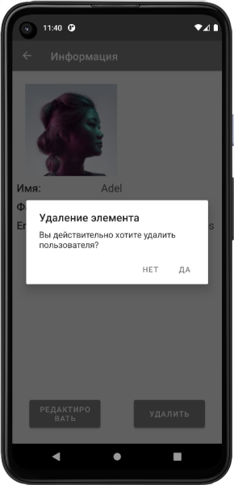
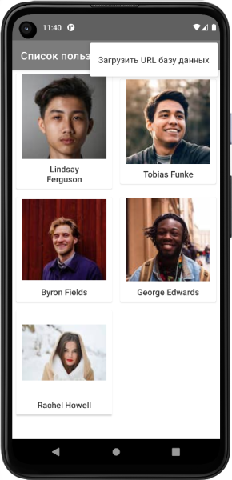

___
# Проект по практике
Данное приложение разработано в качестве поставленной задачи при прохождении практики по мобильной разработке в компании "Neoflex".
## Краткое описание
Данное приложение выполняет следующие задачи:
1.	Получение коллекции пользователей с URL-адреса https://reqres.in/api/users?page=2.
2.	Обработка ответа с сервера и валидация полученной коллекции;
3.	Сохранение коллекции пользователей в базе данных.
4.	Отображение пользователей из базы данных в список в виде карточек.
5.	При нажатии на элемент списка – показывать в окне(Fragment) подробную информацию по выбранному пользователю.
6.  Редактирование данных отдельного пользователя(только в локальной базе данных)
7.	Удаление пользователей(только в локальной базе данных).
8.	Обновление списка пользователей с сервера.

## Используемый стек 
 - Retrofit;
 - Room;
 - Navigation component;
 - Coroutines;
 - [Koin](https://insert-koin.io/);
 - [Coil](https://github.com/coil-kt/coil).

 Приложение написано с соблюдением [Clean Architecture](https://github.com/ImangazalievM/CleanArchitectureManifest/blob/master/README-RU.md) и [MVVM](https://en.wikipedia.org/wiki/Model%E2%80%93view%E2%80%93viewmodel) подхода.

 ## Flow приложения

 **Точка старта приложения** - Открывается список с пользователями, элементы загружаются из локальной базы данных. 

 

 При нажатии на элемент в списке откроется окно с подробной информацией о пользователе:

 

 Здесь есть возможность просмотреть подробную информацию о пользователе, а также удалить или редактировать открытый элемент. При нажатии на кнопку "Редактировать" откроется окно для редактирования информации данного пользователя:

 

Подчёркнутые поля используются для редактирования соответствующей информации.
 - При нажатии на кнопку "Отмена", все изменения будут сброшены и вернётся предыдущее окно просмотра информации о пользователе.
 - При нажатии на кнопку "Подтвердить", изменения будут сохранены, вернётся предыдущее окно просмотра информации о пользователе и выведется сообщение об состоянии завершения изменения.

 
 

Затем, если выйти в список, можно убедиться в изменении элемента:

 

Также, в окне просмотра информации о пользователе, можно удалить элемент. При нажатии на кнопку "Удалить", выведется диалоговое окно подтверждения удаления:

 

 - При нажатии на кнопку "Нет", диалоговое окно закроется.
 - При нажатии на кнопку "Да", элемент будет удалён, откроется обновлённый список элементов, выведется сообщение об состоянии удаления элемента.

 

 В окне списка пользователей есть возможность обновить базу данных с удалённого хоста. Для этого в меню нужно выбрать пункт "Загрузить URL базу данных". После нажатия, локальная база данных будет обновлена в соответствии с удалённой базой данных и выведется сообщение о состоянии загрузки.

 
 
